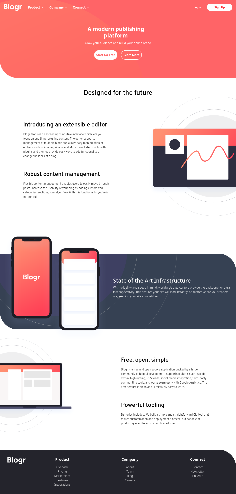

# Frontend Mentor - Blogr landing page solution

This is a solution to the [Blogr landing page challenge on Frontend Mentor](https://www.frontendmentor.io/challenges/blogr-landing-page-EX2RLAApP). Frontend Mentor challenges help you improve your coding skills by building realistic projects. 

## Table of contents

- [Overview](#overview)
  - [The challenge](#the-challenge)
  - [Screenshot](#screenshot)
  - [Links](#links)
- [My process](#my-process)
  - [Built with](#built-with)
  - [What I learned](#what-i-learned)
  - [Continued development](#continued-development)
  - [AI Collaboration](#ai-collaboration)
- [Author](#author)

## Overview

### The challenge

Users should be able to:

- View the optimal layout for the site depending on their device's screen size
- See hover states for all interactive elements on the page

### Screenshot

### Links

- Solution URL: [Solution URL](https://your-solution-url.com)
- Live Site URL: [Live site URL](https://r1v3ra-1508.github.io/blogr-landing-page)

## My process

### Built with

- Semantic HTML5 markup
- CSS custom properties
- Flexbox
- CSS Grid
- Mobile-first workflow
- [TailwindCSS](https://tailwindcss.com) - styles

### What I learned

I practiced creating landing pages from a jpg picture. Sure, it's not Pixel Perfect, but it's very close

### Continued development

I'll improve adaptive styles, cuz now it's not very good on tablets and some other screens

### AI Collaboration
- ChatGPT (Codex) 
- Helped me a lot with #articles and #articles_2

## Author
- Frontend Mentor - [@R1V3RA-1508](https://www.frontendmentor.io/profile/r1v3ra-1508)
- GitHub - [r1v3ra-1508](https://github.com/r1v3ra-1508)
